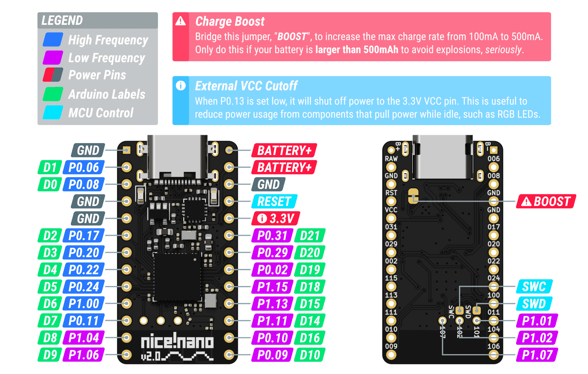
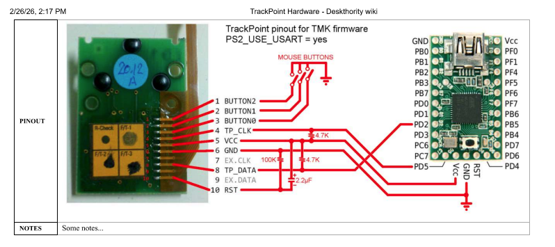

# Keyboard Layout

Custom keyboard: **12 columns** (C1..C12) × **7 rows** (R1..R7), Colemak base layout.

## Key Matrix

|        | C1    | C2 | C3 | C4    | C5    | C6     | C7     | C8     | C9        | C10  | C11  | C12    |
| ------ | ----- | -- | -- | ----- | ----- | ------ | ------ | ------ | --------- | ---- | ---- | ------ |
| **R1** | Esc   | F1 | F2 | F3    | F4    | F5     | F6     | F7     | F8        | F9   | F10  | Delete |
| **R2** | =     | 1  | 2  | 3     | 4     | 5      | 6      | 7      | 8         | 9    | 0    | -      |
| **R3** | ~     | Q  | W  | F     | P     | G      | J      | L      | U         | Y    | ;    | [      |
| **R4** | '     | A  | R  | S     | T     | D      | H      | N      | E         | I    | O    | ]      |
| **R5** | LWin  | Z  | X  | C     | V     | B      | K      | M      | ,         | .    | /    | RWin   |
| **R6** | M1    | M2 | M3 | Space | Tab   | LShift | RShift | Backspace | Enter | Home | Up   | End    |
| **R7** | M4    | M5 | M6 | —     | LCtrl | LAlt   | RAlt   | RCtrl  | —         | Left | Down | Right  |

> `—` means the key is physically not present on the board.

## Layout strategy: QWERTY-positional firmware + OS Colemak

The table above shows the **Colemak** characters printed on the keycaps — what
the user sees when typing. The firmware, however, sends **QWERTY positional
scan codes**; the Colemak remap is done by the operating system.

- OS must be configured for Colemak (Windows: *Settings → Time & language →
  Language → English (US) → Keyboard → Colemak*; Linux: `setxkbmap us -variant colemak`; macOS: *System Settings → Keyboard → Input Sources → Colemak*).
- Swapping OS layout to QWERTY gives a plain QWERTY keyboard — the keycap
  labels stop matching, but the firmware doesn't need to be reflashed.
- Other keyboards on the same machine keep typing normally.

### Position remaps (Colemak keycap → QWERTY scan code sent by firmware)

Only three letter rows are affected; digits, symbols, modifiers, and the
top/bottom rows are untouched by the Colemak layout.

| Keycap (Colemak) | Scan code sent |     | Keycap (Colemak) | Scan code sent |
| ---------------- | -------------- | --- | ---------------- | -------------- |
| F                | `E`            |     | R                | `S`            |
| P                | `R`            |     | S                | `D`            |
| G                | `T`            |     | T                | `F`            |
| J                | `Y`            |     | D                | `G`            |
| L                | `U`            |     | N                | `J`            |
| U                | `I`            |     | E                | `K`            |
| Y                | `O`            |     | I                | `L`            |
| ;                | `P`            |     | O                | `SEMI`         |
| K                | `N`            |     |                  |                |

Unchanged keys (same position in both layouts): `Q W A H Z X C V B M , . /`
plus all non-letter keys.

## Macro Keys

`M*` keys send hotkey combinations:

| Key | Combination   |
|-----|---------------|
| M1  | Shift + F10   |
| M2  | Shift + F9    |
| M3  | Ctrl + F2     |
| M4  | F8            |
| M5  | F7            |
| M6  | F9            |

## Bluetooth (multi-device)

Поддерживается до **5 BT-профилей** (ZMK default). Переключение между устройствами
и управление привязками — на отдельном слое `bt`.

### Вход / выход на BT-слой

Комбо **`Esc` + `Del`** (углы верхнего ряда, нажать одновременно в течение 50 мс)
— переключает слой `bt` вкл/выкл. Работает из любого состояния (оба направления).

### Управление на BT-слое

На этом слое переназначен только ряд цифр; остальные клавиши прозрачны (`&trans`)
и продолжают работать как в base layer.

| Клавиша (Colemak label) | Действие                                                  |
| ----------------------- | --------------------------------------------------------- |
| `1`..`5`                | Выбрать BT-профиль 1..5 (активно для ввода)               |
| `6`                     | Переключить HID-вывод в **USB**                           |
| `7`                     | Переключить HID-вывод в **BLE**                           |
| `0`                     | **Удалить привязку текущего профиля** (для re-pair)       |
| `=`                     | **Удалить привязки ВСЕХ профилей** (nuclear, используй осторожно) |

### Типичные сценарии

**Подключить новое устройство к свободному слоту:**
1. `Esc+Del` → вошли в BT-слой.
2. Нажми свободный номер (`1`..`5`) — выбран пустой профиль.
3. Клавиатура сразу начнёт advertise под этим профилем — найди её в настройках
   Bluetooth нового устройства и начни pairing.
4. На устройстве появится 6-значный код. **Набери этот код на клавиатуре** и
   нажми `Enter`. Это требование `CONFIG_ZMK_BLE_PASSKEY_ENTRY=y` — без него
   любое чужое устройство в радиусе действия может спариться без подтверждения.
5. `Esc+Del` → вышли обратно.

> **Passkey pairing:** включено `CONFIG_ZMK_BLE_PASSKEY_ENTRY=y`. При каждом
> новом pairing OS показывает 6-значный код, который надо ввести цифрами на
> самой клавиатуре и подтвердить `Enter`. Без физического доступа к клавиатуре
> спариться невозможно. Уже спаренные устройства этот шаг не требуют.

**Перепривязать слот к новому устройству:**
1. Сначала убери клавиатуру из старого устройства (в его настройках Bluetooth),
   иначе оно будет автоматически переподключаться.
2. `Esc+Del` → BT-слой.
3. Нажми номер слота, который хочешь перепривязать (`1`..`5`).
4. Нажми `0` — привязка текущего профиля удалена.
5. Нажми тот же номер ещё раз — слот пустой, можно паровать с новым устройством.
6. `Esc+Del` → выход.

**Быстрое переключение между уже подключёнными устройствами:**
`Esc+Del` → `1` (или `2..5`) → `Esc+Del`. 2-3 клика.

**Перейти на проводной USB:**
`Esc+Del` → `6` (USB) → `Esc+Del`. Обратно на BLE — `7`.

> **Когда вообще нужны `6`/`7`?** Обычно — никогда. ZMK сам переключает
> вывод: воткнул кабель → USB, выдернул → BLE. Ручной override `&out` нужен
> только если **оба** канала активны одновременно и хочется зафиксировать
> один. Типичный пример: кабель воткнут только для зарядки, а печатать
> хочется через BLE — `&out OUT_BLE` заблокирует автопереход на USB.

## Controller

**nice!nano clone** (ProMicro NRF52840).



### Column pinout (mirrored)

| Column | Silkscreen | nRF52840 | ZMK devicetree   |
| ------ | ---------- | -------- | ---------------- |
| C1     | D21        | P0.31    | `&pro_micro 21`  |
| C2     | D20        | P0.29    | `&pro_micro 20`  |
| C3     | D19        | P0.02    | `&pro_micro 19`  |
| C4     | D18        | P0.03    | `&pro_micro 18`  |
| C5     | D15        | P0.24    | `&pro_micro 15`  |
| C6     | D14        | P0.22    | `&pro_micro 14`  |
| C7     | D8         | P1.04    | `&pro_micro 8`   |
| C8     | D7         | P0.11    | `&pro_micro 7`   |
| C9     | D6         | P1.00    | `&pro_micro 6`   |
| C10    | D5         | P1.13    | `&pro_micro 5`   |
| C11    | D4         | P1.11    | `&pro_micro 4`   |
| C12    | D3         | P0.21    | `&pro_micro 3`   |

### Row pinout

| Row | Silkscreen | nRF52840 | ZMK devicetree  |
| --- | ---------- | -------- | --------------- |
| R1  | D16        | P0.20    | `&pro_micro 16` |
| R2  | D10        | P1.06    | `&pro_micro 10` |
| R3  | P1.07      | P1.07    | `&gpio1 7`      |
| R4  | P1.02      | P1.02    | `&gpio1 2`      |
| R5  | P1.01      | P1.01    | `&gpio1 1`      |
| R6  | D9         | P0.17    | `&pro_micro 9`  |
| R7  | D2         | P0.10    | `&pro_micro 2`  |

### kscan snippet

Готовый фрагмент для `<shield>.overlay` (колонки как выходы, ряды как входы,
diode-direction `col2row`):

```dts
kscan0: kscan {
    compatible = "zmk,kscan-gpio-matrix";
    diode-direction = "col2row";
    wakeup-source;

    row-gpios
        = <&pro_micro 16 (GPIO_ACTIVE_HIGH | GPIO_PULL_DOWN)>   // R1
        , <&pro_micro 10 (GPIO_ACTIVE_HIGH | GPIO_PULL_DOWN)>   // R2
        , <&gpio1      7 (GPIO_ACTIVE_HIGH | GPIO_PULL_DOWN)>   // R3
        , <&gpio1      2 (GPIO_ACTIVE_HIGH | GPIO_PULL_DOWN)>   // R4
        , <&gpio1      1 (GPIO_ACTIVE_HIGH | GPIO_PULL_DOWN)>   // R5
        , <&pro_micro  9 (GPIO_ACTIVE_HIGH | GPIO_PULL_DOWN)>   // R6
        , <&pro_micro  2 (GPIO_ACTIVE_HIGH | GPIO_PULL_DOWN)>   // R7
        ;

    col-gpios
        = <&pro_micro 21 GPIO_ACTIVE_HIGH>   // C1
        , <&pro_micro 20 GPIO_ACTIVE_HIGH>   // C2
        , <&pro_micro 19 GPIO_ACTIVE_HIGH>   // C3
        , <&pro_micro 18 GPIO_ACTIVE_HIGH>   // C4
        , <&pro_micro 15 GPIO_ACTIVE_HIGH>   // C5
        , <&pro_micro 14 GPIO_ACTIVE_HIGH>   // C6
        , <&pro_micro  8 GPIO_ACTIVE_HIGH>   // C7
        , <&pro_micro  7 GPIO_ACTIVE_HIGH>   // C8
        , <&pro_micro  6 GPIO_ACTIVE_HIGH>   // C9
        , <&pro_micro  5 GPIO_ACTIVE_HIGH>   // C10
        , <&pro_micro  4 GPIO_ACTIVE_HIGH>   // C11
        , <&pro_micro  3 GPIO_ACTIVE_HIGH>   // C12
        ;
};
```

> Если матричные диоды стоят катодом к ряду (row) — оставляй `col2row`.
> Если катодом к колонке — меняй на `row2col` и инвертируй active/pull.

## Trackpoint



| Signal   | Silkscreen | nRF52840 | ZMK devicetree |
| -------- | ---------- | -------- | -------------- |
| TP_DATA  | D0         | P0.08    | `&pro_micro 0` |
| TP_CLK   | D1         | P0.06    | `&pro_micro 1` |

Driver: [infused-kim/kb_zmk_ps2_mouse_trackpoint_driver](https://github.com/infused-kim/kb_zmk_ps2_mouse_trackpoint_driver)

### Firmware integration

The trackpoint support requires **a ZMK fork** (`infused-kim/zmk` branch
`pr-testing/mouse_ps2_module_base`) — upstream ZMK has not merged the mouse
pointer PR yet. This is configured in `config/west.yml`.

Trackpoint-specific devicetree lives in
`boards/shields/martos05/martos05-trackpoint.dtsi` and is `#include`-d from
`martos05.overlay`. It contains:

- Pin assignments (SCL=D1, SDA=D0) and the matching pinctrl (`P0.06` for SDA).
- Reconfiguration of `uart0` to UART-PS/2 mode at 14400 baud.
- `mouse_ps2` + `mouse_ps2_input_listener` nodes (status = "okay").
- Interrupt-priority overrides for every nRF52840 peripheral so BLE cannot
  delay PS/2 service past its 30–50 µs budget.

### Known caveats

- **No reset pin wired** — the trackpoint will initialise only if the board
  has an external Power-On-Reset circuit (typical capacitor + resistor on the
  TP_RST line). Without POR some trackpoints fail to enumerate on cold start;
  a USB re-plug usually works around it.
- To click / scroll you still need keymap bindings (`&mkp LCLK/RCLK/MCLK`,
  `&msc SCRL_UP/DOWN`). The base layer currently has none — add them on a
  mouse layer when needed.
- The trackpoint only reports through the **current HID output**. On BLE, it
  moves the cursor on whatever device is on the selected profile; on USB, on
  the wired host. Switch outputs the same way as the keyboard itself
  (`Esc+Del → 6/7`).
